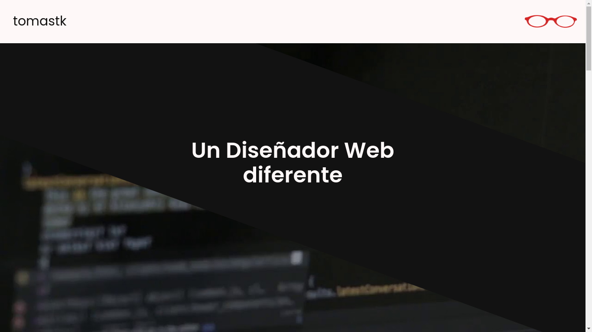

# Portafolio

> "Un diseñador web diferente"
>

## **Ver la demo**

**[TomásTK Portafolio](https://tomastk.github.io/portafolio "Mi Portafolio")**

---
## **Descripción**

Este es el código fuente de mi portafolio. Aquí muestro mis proyectos actuales y todas las practicas que he hecho hasta ahora. Los proyectos que se muestran en este portafolio son meramente educativos, no son aplicados (*aún*) a un proyecto **real**.

---

## **Captura de Pantalla**

---

## **Lenguajes Utilizados en el sitio web:**

* **HTML**: HTML Vanilla, sin ningun preprocesador.

* **CSS**: CSS Vanilla, sin ningun framework o libreria.

* **JS**: Javascript Vanilla, sin ningun framework ni libreria.

### **Extras Utilizados**:

----

- Libreria Normalize.css para resetear los estilos del navegador
- Google Fonts para añadir la fuente Poppins
- Font Awesome para darle los iconos

---

#### Esta es una página totalmente open Source. Si quieres usar el código, tienes toda la libertad.

---

-*TomasTK*